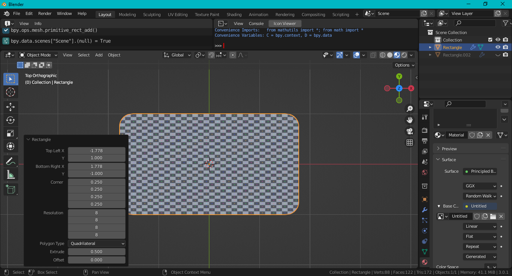

# Rounded Rectangle

Blender add-on to create a rounded rectangle.

To install, go to `Edit > Preferences > Add-ons`, then click the `Install` button and select the `rounded_rect_mesh.py` file. Enable the add-on after it has been installed. To add a rectangle, go to `Add > Mesh > Rectangle` while in object mode.

Defaults to a 16:9 aspect ratio. There are three polygon types: n-gon, quadrilateral and triangle. Both quadrilateral and triangle types use triangle fans for the corners. The mesh includes UV coordinates. The UV aspect ratio is stretched to the rectangle. Includes an option to append a solidify modifier to the mesh.

A variant to create a 2D curve is also available in `rounded_rect_curve.py`. When installed, a Bezier curve rectangle can be added via `Add > Curve > Rectangle`.